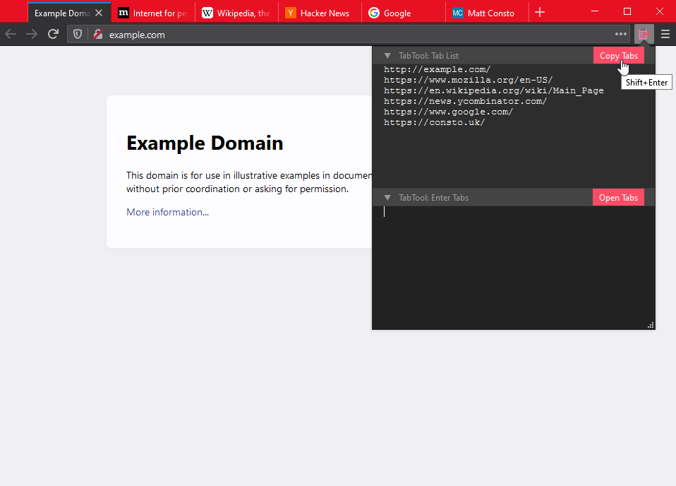

# TabTool Browser Extension

TabTool is a minimal Chrome/Firefox/Opera/etc. browser extension that lets you easily copy, manipulate, and open list of URLs.

## Features

* Copy the currently open tabs to clipboard.
* Paste lists of URLs and open them in new tabs.
* Select a list of URLs in a page and open them in new tabs.
* Light and dark mode.

## License

This browser extension is [MIT licensed](LICENSE), with the exception of [extension.css](extension/extension.css) which is [MPL licensed](https://www.mozilla.org/en-US/MPL/2.0).
